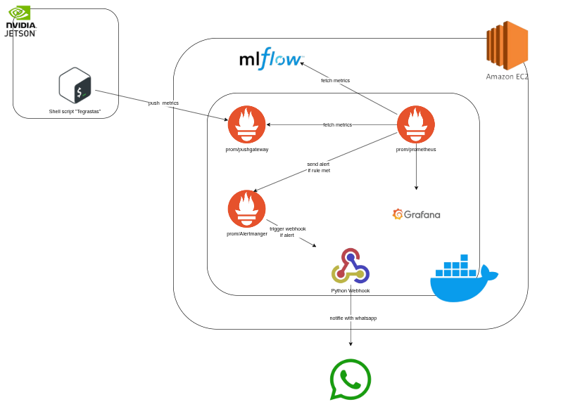

# Jetson Monitoring Dashboard

This repository contains scripts and Docker Compose configuration for monitoring a Jetson device using Prometheus, Grafana, and Alertmanager.

## Features

- Real-time system monitoring
- GPU and CPU usage tracking
- Memory and storage metrics
- Temperature and power monitoring
- Alerting system with Alertmanager
- Beautiful dashboards with Grafana

## Prerequisites

- NVIDIA Jetson Device
- Docker installed
- Docker Compose installed

## Getting Started

### System Architecture


###  Description

1. **NVIDIA Jetson Device**  
   - A shell script (`tegrastats`) runs on the Jetson to collect **system metrics** such as CPU, GPU, memory, and temperature.  
   - These metrics are **pushed** to the `prom/pushgateway` component.

2. **Prometheus Pushgateway**  
   - Receives metrics pushed from the Jetson device.  
   - Makes them available for Prometheus to **scrape and store** periodically.

3. **Prometheus**  
   - Central component that **collects, stores, and queries** time-series metrics.  
   - Fetches metrics both from the **Pushgateway** and **MLflow** (model tracking server).  
   - If an alerting rule is triggered (e.g., temperature too high, GPU overload), Prometheus notifies Alertmanager.

4. **Alertmanager**  
   - Handles alerts sent by Prometheus.  
   - When a rule condition is met, it **triggers a Python webhook** that sends a custom notification.

5. **Python Webhook**  
   - A small Python service that receives alerts from Alertmanager.  
   - It can forward notifications to external channels such as **WhatsApp** for real-time monitoring updates.

6. **Grafana**  
   - Provides **interactive dashboards** to visualize metrics (CPU, GPU, power, memory, etc.) collected by Prometheus.  
   - Dashboards run inside a Docker container on the **Amazon EC2 instance**.

7. **Amazon EC2**  
   - Hosts the entire monitoring stack (Prometheus, Grafana, Alertmanager, MLflow, Webhook services) using Docker containers.

---

###  Workflow Summary

1. Jetson → Pushgateway → Prometheus → Grafana (visualization)  
2. Prometheus → Alertmanager → Python Webhook → WhatsApp (alerting)  
3. MLflow ↔ Prometheus (model performance metrics collection)


### 1. Clone the repository
```bash
git clone https://github.com/WiseVision-AI-Tech/Models-Monitor.git
cd Models-Monitor
```
### 2. Fix script permissions
```bash
chmod +x scripts/fix_permissions.sh
./scripts/fix_permissions.sh
```
### 3. Start the monitoring stack
```bash
docker compose up -d
```